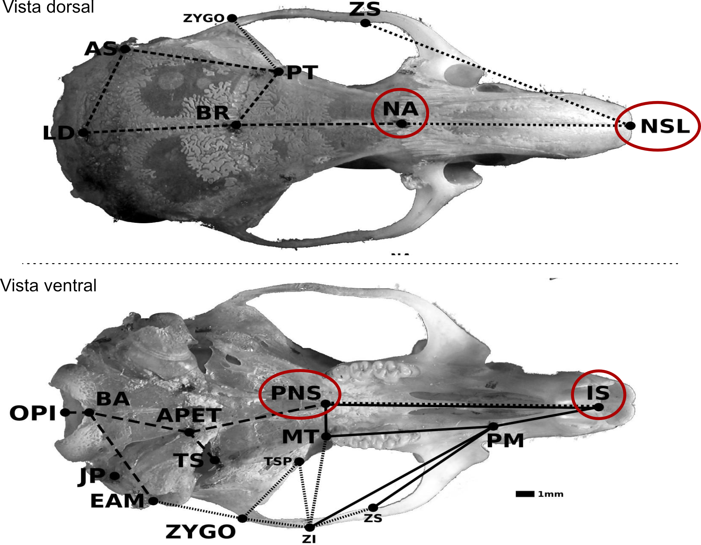

```{r setup, echo=FALSE}
library(rmarkdown)
knitr::opts_chunk$set(eval = TRUE)
# clipboard
htmltools::tagList(
  xaringanExtra::use_clipboard(
    button_text = "Copy code <i class=\"fa fa-clipboard\"></i>",
    success_text = "Copied! <i class=\"fa fa-check\" style=\"color: #90BE6D\"></i>",
    error_text = "Not copied 😕 <i class=\"fa fa-times-circle\" style=\"color: #F94144\"></i>"
  ),
  rmarkdown::html_dependency_font_awesome()
  )
```

# Simple linear models

A regressão linear impõe ou presume que exista uma relação linear entre uma ou mais variáveis preditoras $x_i$ e uma variável resposta $y$.

$$y_i \sim Normal(\mu_i, \sigma) \\
\mu_i = \alpha + \beta x_i$$

A primeira linha desse modelo descreve a distribuição de probabilidade da variável $y$. Ela pode ser modelada como uma variável com uma distribuição normal, com uma média $\mu$ e um desvio-padrão $\sigma$.

A segunda linha do modelo relaciona as variáveis preditoras X com a média esperada μ (mu), baseada numa relação causal hipotetizada entre X e Y. Nesse caso simples, a relação é linear e pode ser representada por uma linha que é dada pelos parâmetros de intercepto α (alfa) e de inclinação β (beta).

## Gerando um conjunto de dados.

Para esse tutorial introdutório, vamos utilizar dados simulados, de forma que conheçamos a relação real entre as variáveis X e Y.

```{r create_dataset}
N = 30
x <- runif(N, 0, 5)
n <- length(x)
mu <- 1.2 + 3.5 * x # α = 1.2 e β = 3.5.
y <- rnorm(N, mean = mu, sd = 3)
lm_data <- data.frame(x,  mu, y, res = y - mu)
```

Um gráfico simples para os dados:

```{r plot, fig.asp=1}
plot(y ~ x, pch = 19)
```

Como podemos ver no gráfico, parece haver uma relação linear simples entre as duas variáveis, como previsto pela simulação.

## Coeficiente de regressão

Podemos estimar o valor dos parâmetros alfa e beta usando muitos métodos diferentes. O método mais comum é o Ordinary Least Squares (OLS), que produz soluções analíticas para o valor desses dois coeficientes.

O valor do coeficiente beta é dado pela covariância entre X e Y, dividido pela variância de X. E o intercepto alpha é dado pela média de Y menos o produto do valor de beta pela média de X.

$$\widehat{\beta}= \frac{Cov(x, y)}{Var(x)} = \frac{\sum_{i=1}^{n}(x_i-\bar{x})(y_i-\bar{y})}{\sum_{i=1}^{n}(x_i-\bar{x})^2}$$

and 

$$
\hat{\alpha} = \bar{y} - \hat{\beta}\bar{x} 
$$


```{r beta0 and beta1}
beta_hat <- sum((x - mean(x)) * (y - mean(y))) / sum((x - mean(x)) ^ 2)
beta_hat

# This is just the ratio of the covariance between x and y and the variance of x
cov(x, y) / var(x)

# Since mu = alpha + beta*x: 
alpha_hat <- mean(y) - beta_hat * mean(x)
alpha_hat
```

Usando esse valor dos parâmetros, podemos incluir a retro-regressão no gráfico que fizemos acima.

```{r OLS, fig.asp=1}
plot(y ~ x, pch = 19)
abline(a = alpha_hat, b = beta_hat, col = 2, lwd = 2)
```

## Usando a função lm() para ajustar o modelo

Claro que não precisamos calcular os parâmetros diretamente. Podemos usar uma função do R para ajustar esse modelo linear. Essa função é a função "lm" e pode ser chamada usando a sintaxe de fórmula do R.

```{r}
m1 = lm(y ~ x)
m1
```

Com o modelo ajustado, podemos usar a função "summary" para ver as estimativas dos coeficientes, que devem ser idênticas às que obtivemos acima, e também a sua significância e várias outras informações úteis.

```{r}
summary(m1)
```

## Resíduos da regressão

Uma vez que o modelo está ajustado, podemos calcular os seus resíduos ($e_i$). Ao invés de tratarmos os resíduos simplesmente como "erros", vamos tratar esses valores como a **variação residual não explicada pela variável preditora**.

Matematicamente, o resíduo para a observação $i$ é a diferença entre o valor real observado ($y_i$) e o valor predito pelo nosso modelo linear ($\mu_i$):

$$e_i = y_i - \mu_i$$

Podemos extrair essa variação não explicada diretamente do nosso modelo ajustado no R usando funções nativas:

```{r extract_residuals}
# Extraindo os valores preditos (a porção de y explicada por x)
mu <- fitted(m1)

# Extraindo os resíduos (a variação residual não explicada)
res <- residuals(m1)

```

Para entender o poder dessa extração, precisamos visualizar os resíduos de duas perspectivas complementares. A primeira delas é a perspectiva geométrica, pela qual enxergamos o resíduo como a distância vertical entre o dado observado e a reta de regressão.

```{r plot_res_distance, fig.asp=1}
# 1. Visualizando os resíduos como distância da reta
plot(y ~ x, pch = 19, main = "Perspectiva 1: Distância da reta de regressão")
abline(m1, col = "red", lwd = 2)

# Desenhando linhas conectando os pontos reais aos valores preditos
segments(x0 = x, y0 = y, x1 = x, y1 = mu, col = "blue", lty = 2)

```

A segunda perspectiva é muito mais poderosa para nossos usos: podemos isolar essas distâncias (as linhas azuis tracejadas do gráfico acima) e tratá-las como uma nova variável: os valores de y descontados os efeitos de x.

```{r plot_res_variable, fig.asp=1}
# 2. Visualizando os resíduos como uma variável independente
plot(res ~ x, pch = 19, col = "blue", 
     main = "Perspectiva 2: A variação residual como variável",
     ylab = "Variação residual não explicada")
abline(h = 0, col = "red", lwd = 2, lty = 2)

```

Compare os dois gráficos. O segundo gráfico é essencialmente o primeiro, mas nós "rotacionamos" a linha de regressão até que ela ficasse horizontal, centralizada no zero.

Entender os resíduos como uma variável própria, limpa da influência de um preditor específico, é o que nos permitirá usar a regressão como uma ferramenta de controle estatístico. Mais à frente neste tutorial, usaremos essa  propriedade para descontar nossas variáveis de interesse de fontes de variação espúria.

## Variáveis preditoras discretas

Caso a variável preditora X não seja contínua, o modelo linear pode ser usado da mesma maneira. Vamos simular dados em que a variável resposta Y represente o peso de um indivíduo e a variável X seja o estado nutricional: bem alimentado ou mal alimentado.

```{r}
set.seed(1)
# 1. Criar a variável preditora X (Categórica)
n <- 100
estado_nutricional <- sample(c("bem_alimentado", "mal_alimentado"), n, replace = TRUE)
peso_medio_por_classe = c("bem_alimentado" = 75, "mal_alimentado" = 60)
peso <- peso_medio_por_classe[estado_nutricional] + rnorm(n, mean = 0, sd = 5)

# Criar o dataframe
dados <- data.frame(peso, estado_nutricional)
head(dados)
```

Agora vamos ajustar um modelo linear e tentar capturar a diferença nas médias nessas duas classes.

```{r}
m2 = lm(peso ~ estado_nutricional)
summary(m2)
```

Nesse caso, o modelo retorna um coeficiente que nós chamamos de um contraste, mostrando a diferença na média entre os indivíduos bem alimentados e mal alimentados. Os indivíduos mal alimentados tendem a ser aproximadamente 15 kg mais leves que os bem alimentados.

```{r, message = FALSE, warning = FALSE}
# install.packages( "ggplot2") # se necessario...
library(ggplot2)

ggplot(dados, aes(estado_nutricional, peso, color = estado_nutricional)) + geom_boxplot() + geom_jitter(width = 0.1)  
```

O coeficiente beta representa a diferença na média desses dois conjuntos de observações. 

**Pergunta: Qual seria a estrutura dos resíduos dessa regressão?**

# Regressão múltipla

Nós podemos estender a regressão linear para mais de uma variável preditora. Nesse caso, a média esperada de Y é uma função linear de mais de uma variável X.

$$y_i \sim Normal(\mu_i, \sigma) \\
\mu_i = \alpha + \sum \beta_j x_{ij}$$

## Relação entre regressão múltipla e simples

A relação entre os coeficientes da regressão múltipla e da regressão simples depende da relação entre as variáveis X. Quando as variáveis X são não correlacionadas, os coeficientes da regressão múltipla e da regressão simples são idênticos.

Vamos fazer um exemplo simulado para entender isso. Primeiro, vamos simular duas variáveis preditoras não correlacionadas, chamadas x e z.

```{r}
set.seed(1)
n = 100
# Duas preditoras, x e z
x = rnorm(n)
z = rnorm(n)

# y é função de x e z.
a = 1; b_x = 1.35; b_z = 3.5
y = a + b_x * x + b_z * z + rnorm(n)
```

Primeiro, vamos olhar para os coeficientes das regressões simples, de y em x, depois de y em z.

```{r}
lm(y ~ x) |> coefficients() |> round(2)
lm(y ~ z) |> coefficients() |> round(2)
```

Os valores dos coeficientes de X e Z são muito parecidos com os valores simulados.

Finalmente, vamos olhar para os coeficientes da regressão múltipla, ajustando coeficientes para X e Y simultaneamente.

```{r}
lm(y ~ x + z) |> coefficients() |> round(2)
```

Note como os valores dos coeficientes calculados pela regressão simples e pela regressão múltipla são idênticos. Isso acontece sempre que as variáveis preditoras são não correlacionadas.

## Preditores correlacionados na regressão múltipla

A situação muda quando os preditores são correlacionados. Vamos simular um exemplo em que X e Z são ambos causados por uma mesma variável não observada U.

```{r}
set.seed(2)
n = 100
u = rnorm(n)

# X e Z são funções de u?
x = 1 + 0.5 * u + rnorm(n)
z = 3 + 2   * u + rnorm(n)

# y é função de x e z.
a = 1; b_x = 1.35; b_z = 3.5
y = a + b_x * x + b_z * z + rnorm(n)
```

Agora, vamos novamente olhar para os coeficientes da regressão simples de Y em X e de Y em Z.

```{r}
lm(y ~ x) |> coefficients() |> round(2)
lm(y ~ z) |> coefficients() |> round(2)
```

Veja como agora os coeficientes da regressão simples são completamente diferentes dos coeficientes que usávamos para fazer a simulação ($b_x = 1.35$; $b_z = 3.5$). 

Mas, se incluirmos tanto o X quanto o Z na regressão, conseguimos recuperar esses valores simulados.

```{r}
lm(y ~ x + z) |> coefficients() |> round(2)
```

## Recuperando os coeficientes da regressão múltipla usando residuos

Lembra-se de quando definimos os resíduos como a *variação residual não explicada* e vimos que poderíamos usá-los como uma nova variável independente? 

Podemos reproduzir os coeficientes da regressão múltipla usando apenas regressões simples, aplicando o conceito de resíduos. Para descobrir o efeito isolado de $x$ sobre $y$ (descontando $z$), precisamos primeiro descontar o efeito de $z$ na variável $x$.

Podemos fazer isso em três passos:

1. Ajustamos um modelo em que $x$ é a variável resposta e $z$ é a preditora.
2. Extraímos os resíduos dessa regressão. Essa nova variável representará a variação de $x$ que é independente de $z$.
3. Ajustamos um novo modelo simples de $y$ contra esses resíduos de $x$.

Vamos ver isso em código:

```{r}
# 1. Regredimos a variável X contra a variável Z
m_xz <- lm(x ~ z)

# 2. Extraímos os resíduos (a variação de X que não tem relação com Z)
res_x <- residuals(m_xz)

# 3. Regredimos Y contra esse X residual
lm(y ~ res_x) |> coefficients() |> round(2)

```

Observe a estimativa do coeficiente para `res_x`. Ela é idêntica ao coeficiente de $x$ que obtivemos na regressão múltipla `lm(y ~ x + z)`!

Podemos fazer exatamente o mesmo procedimento para isolar o efeito de $z$ sem a influência de $x$:

```{r}
# Isolando Z: regredimos Z em função de X e extraímos os resíduos
res_z <- residuals(lm(z ~ x))

# Regredimos Y contra o Z residual
lm(y ~ res_z) |> coefficients() |> round(2)

```

Novamente, o coeficiente obtido na regressão simples bate com o coeficiente de $z$ no modelo múltiplo.

Esse processo ilustra o [Teorema de Frisch-Waugh-Lovell](https://en.wikipedia.org/wiki/Frisch%E2%80%93Waugh%E2%80%93Lovell_theorem): a regressão múltipla não é nada além de uma série de regressões simples nas quais o efeito de cada variável preditora é estimado usando apenas a parte da sua variação que é única e não compartilhada com os demais preditores do modelo.

## Controlando efeitos espúrios

Essas propriedades da regressão múltipla são usadas no contexto de genética quantitativa para remover fontes de variação que não são relevantes para o estudo em questão.

Vamos usar um exemplo com dados reais: o conjunto de dados **ratones**, que contém medidas cranianas de 5 populações experimentais de camundongos (https://onlinelibrary.wiley.com/doi/full/10.1111/evo.13304).

```{r}
ratones <- read.table("https://raw.githubusercontent.com/diogro/evofencom/refs/heads/main/Tutoriais/ratones.tsv", header = TRUE)
```

Esse é um conjunto de dados relativamente grande.

As primeiras colunas representam variáveis categóricas, como:

- ID de cada indivíduo
- O sexo de cada indivíduo
- A qual geração o indivíduo pertence
- A qual linhagem ele pertence
- O ID da mãe e do pai do indivíduo
- A idade do indivíduo em dias
- Qual linhagem ele pertence
- Qual o peso dele aos 49 dias

E a partir da coluna IS_PM até a coluna BA_OPI, temos as distâncias cranianas em milímetros.

```{r}
str(ratones)
```

Nosso objetivo é estimar a correlação fenotípica entre um par de variáveis cranianas: o comprimento do osso nasal e o comprimento do palato, dados pelas variáveis NSL_NA e IS_PNS.

```{r  label = distances, echo = FALSE, fig.cap = "Vista ventral e dorsal de um crânio de roedor, com os pontos envolvidos no cálculo das distâncias de interesse circulados em vermelho", out.width = '100%'}

```

Vamos começar onde devemos começar sempre, **com uma visualização dos dados**. Vamos fazer um gráfico da relação entre essas duas variáveis, usando cores e símbolos para visualizar os fatores de confusão: sexo e linhagem.

```{r, warning=FALSE}
ggplot(ratones, aes(NSL_NA, IS_PNS, color = SEX, shape = line, group = line)) + 
  geom_point() + stat_ellipse() + scale_color_manual(values = 1:2) + theme_classic()
```

Parece haver uma relação entre as duas variáveis; porém, diferenças nas médias entre sexos e linhagens também são aparentes. As elipses estão desenhadas ao redor de cada linhagem, e podemos ver que a média das duas variáveis parece ser diferente em muitas das linhagens.

Antes de usar o modelo linear para controlar esses efeitos espúrios, vamos calcular a correlação bruta, sem nenhuma correção, entre as duas variáveis.

```{r}
x = ratones$NSL_NA
y = ratones$IS_PNS
cor(x, y)
```

Agora, vamos usar um modelo linear para criar um conjunto de dados residual, removendo os efeitos de sexo e linhagem.

```{r}
traits = names(ratones)[12:46]
f = paste0("cbind(", paste(traits, collapse = ","), ") ~ SEX + line") 

# Replicando o formato original dos dados.
ratones_res = ratones 

# Substituindo as medidas pelos resíduos de um modelo linear, incluindo sexo e linhagem.
ratones_res[, traits] = lm(as.formula(f), data = ratones) |> residuals()
```

Esse novo conjunto de dados residual pode ser usado para fazer o mesmo gráfico que fizemos anteriormente, e calcular a mesma correlação.

```{r, warning=FALSE}
ggplot(ratones_res, aes(NSL_NA, IS_PNS, color = SEX, shape = line, group = line)) + 
  geom_point() + stat_ellipse() + scale_color_manual(values = 1:2) + theme_classic()
```

Veja como agora as elipses estão todas sobrepostas: as diferenças nas médias foram removidas pelo modelo linear.

Podemos então calcular a correlação entre essas duas medidas, descontando os efeitos dessas variáveis de confusão.

```{r}
x = ratones_res$NSL_NA
y = ratones_res$IS_PNS
cor(x, y)
```

A correlação, descontadas as variáveis de confusão, é sensivelmente maior do que o valor que havíamos calculado anteriormente. O efeito das variáveis espúrias (sexo e linhagem) estava reduzindo o valor da correlação bruta nos dados. Sem essa correção, nós estaríamos calculando uma correlação que não corresponde às relações fenotípicas encontradas dentro dessas populações.